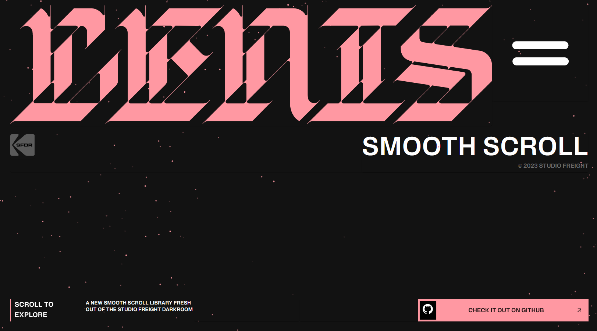
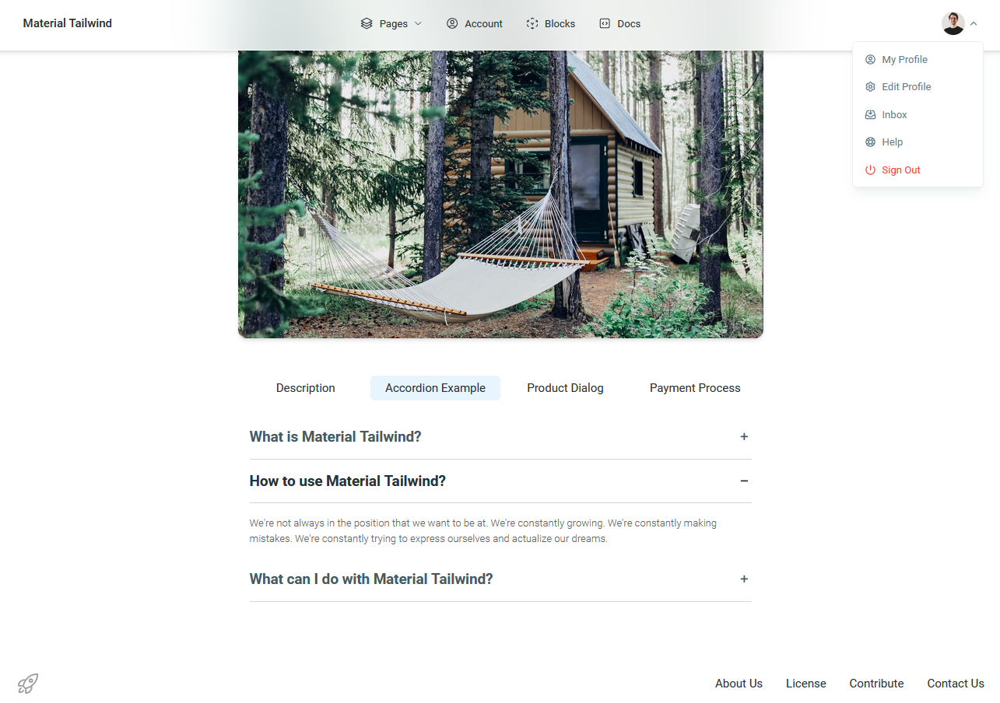

# Blog React

Simple Layout with React with propType, MUI(with Icons), Tailwind, Emotion and Sass.
and Create other Simple Layout with Material Tailwind and Font Awesome, Hero Icons.

## [Demo Link](https://alibagheri2079.github.io/blog-reactjs/)




## Tech Stack

**Client:** React, PropType, Material UI, Material Tailwind, TailwindCSS, Emotion, Postcss with Sass,
Font Awesome and Hero Icons.

## Features

- Yarn, Vite
- React Particles
- Prettier, Eslint, Stylelint Husky and Lint-staged, Browserlist
- Github flow
- Github Page

## Run Locally

Clone the project

```bash
  git clone https://github.com/AliBagheri2079/blog-reactjs.git


```

Go to the project directory

```bash
  cd story-reactjs


```

Install dependencies

```bash
  yarn install


```

Start the server

```bash
  yarn run dev


```

## Deployment

To deploy this project run

```bash
  npm run deploy


```

## 🚀 About Me

I'm Ali Bagheri. Learning about 3 years on Frontend Development Position ...

## 🔗 Links

[](https://github.com/AliBagheri2079)

[](https://www.linkedin.com/in/alibagheri2079/)

[](https://twitter.com/AliBagheri2079)
